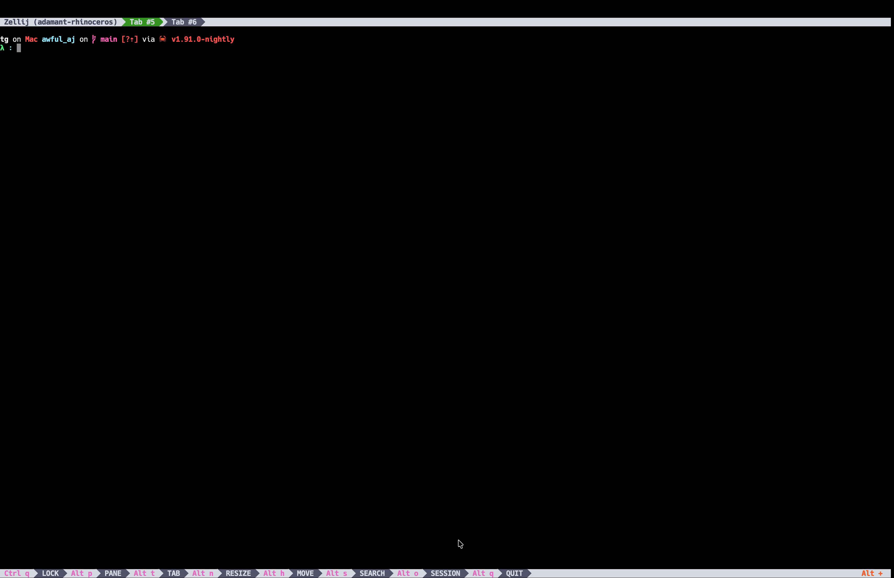

# Awful Jade (`aj`) 🌲

[](https://crates.io/crates/awful_aj)
[](https://docs.rs/awful_aj)

**Awful Jade** (aka **`aj`**) is your command-line sidekick for working with Large Language Models (LLMs).  

Think of it as an _LLM Swiss Army knife with the best intentions_ 😇.

> Ask questions, run interactive sessions, sanitize messy OCR book dumps, synthesize exam questions, all without leaving your terminal.

It's built in Rust for speed, safety, and peace of mind. 🦀

---

```
λ aj --help
Awful Jade – a CLI for local LLM tinkering with memories, templates, and vibes.

Usage: aj <COMMAND>

Commands:
  ask          Ask a single question and print the assistant's response
  interactive  Start an interactive REPL-style conversation
  init         Initialize configuration and default templates in the platform config directory
  reset        Reset the database to a pristine state
  help         Print this message or the help of the given subcommand(s)

Options:
  -h, --help     Print help
  -V, --version  Print version
```

---


---

## ✨ Features

- **Ask the AI**: Run `aj ask "question"` and get answers powered by your configured model.  
- **Interactive Mode**: A REPL-style conversation with memory & vector search (your AI "remembers" past context).  
- **Vector Store**: Uses HNSW + sentence embeddings to remember what you've said before. Basically, your AI gets a brain. 🧠  
- **Brains with Limits**: Keeps only as many tokens as you allow. When full, it forgets the oldest stuff. (Like you after 3 AM pizza.)  
- **Config & Templates**: YAML-driven configs and prompt templates. Customize everything, break nothing.  
- **Auto-downloads embeddings model**: Uses Candle (pure Rust ML framework) to automatically download the `all-MiniLM-L6-v2` BERT model from HuggingFace Hub when needed.  
- **Pure Rust**: No Python dependencies! Everything runs in pure Rust using Candle for ML inference.

---

## 📦 Installation

From [crates.io](https://crates.io/crates/awful_aj):

```bash
cargo install awful_aj
```

This gives you the `aj` binary.

Requirements:
- Rust (use rustup if you don't have it).
  
The embeddings model (`all-MiniLM-L6-v2`) will be downloaded automatically from HuggingFace Hub to your system's cache directory when first needed. Models are cached using the `hf-hub` crate, typically at:
- macOS: `~/.cache/huggingface/hub/`
- Linux: `~/.cache/huggingface/hub/`
- Windows: `C:\Users\YOU\AppData\Local\huggingface\hub\`

---

## 👷🏽‍♀️ Setup

No special setup required! Just install with `cargo install awful_aj` and you're ready to go.

The embeddings model will be downloaded automatically from HuggingFace Hub the first time you use a feature that requires it.

---

## 🚀 Usage

### 1. Initialize

Create default configs, templates, and database:

```
aj init
```

This will generate:
- `config.yaml` with sensible defaults
- `templates/default.yaml` and `templates/simple_question.yaml`
- A SQLite database (`aj.db`) for sessions in your config directory

**Options:**
- `--overwrite`: Force overwrite existing config, templates, and database files

**Example:**
```bash
aj init --overwrite  # Reinitialize everything from scratch
```

---

### 2. Ask a Question

```
aj ask "Is Bibi really from Philly?"
```

You'll get a colorful, model-dependent answer in **yellow** (or **dark gray** if the model uses `<think>` tags for reasoning).

**Options:**
- `-t, --template <NAME>`: Use a specific template (e.g., `simple_question`)
- `-s, --session <NAME>`: Save to a named session for context retention
- `--one-shot`: Ignore any session configured in config.yaml (force standalone prompt)

**Examples:**
```bash
aj ask "What is HNSW?"
aj ask -t simple_question "Explain Rust lifetimes"
aj ask -s my-session "Remember this: I like pizza"
aj ask --one-shot "What's the weather?" # Ignores session from config
```



---

### 3. Interactive Mode

Talk with the AI like it's your therapist, mentor, or rubber duck:

```
aj interactive
```

Supports memory via the vector store, so it won't immediately forget your name.
_(Unlike your barista.)_

**Colors:**
- Your input appears in **blue**
- Assistant responses appear in **yellow**
- Model reasoning (in `<think>` tags) appears in **dark gray**

**Options:**
- `-t, --template <NAME>`: Use a specific template
- `-s, --session <NAME>`: Use a named session

**Examples:**
```bash
aj interactive
aj interactive -s my-session
aj interactive -t reading_buddy -s book-club
```


---

### 4. Reset Database

Start fresh by resetting the database to a pristine state:

```
aj reset
```

This drops all sessions, messages, and recreates the schema. Useful when you want a clean slate.

**Aliases:** `aj r`

---

### 5. Configuration

Edit your config at:

```
~/.config/aj/config.yaml   # Linux
~/Library/Application Support/com.awful-sec.aj/config.yaml   # macOS
```

Example:

```
api_base: "http://localhost:1234/v1"
api_key: "CHANGEME"
model: "jade_qwen3_4b_mlx"
context_max_tokens: 8192
assistant_minimum_context_tokens: 2048
stop_words:
  - "<|im_end|>\\n<|im_start|>"
  - "<|im_start|>\n"
session_db_url: "/Users/you/Library/Application Support/com.awful-sec.aj/aj.db"
```

---

### 6. Templates

Templates are YAML files in your config directory.
Here's a baby template:

```
system_prompt: "You are Awful Jade, a helpful AI assistant programmed by Awful Security."
messages: []
```

Add more, swap them in with `--template <name>`.

---

## 🧠 How it Works

- **Brain**: Keeps memories in a deque, trims when it gets too wordy.
- **VectorStore**: Embeds your inputs using `all-MiniLM-L6-v2` via Candle (pure Rust ML), saves to HNSW index.
- **Candle**: Pure Rust ML framework from HuggingFace. Automatically downloads and caches models from HuggingFace Hub.
- **Config**: YAML-based, sane defaults, easy to tweak.
- **Templates**: Prompt engineering without copy-pasting into your terminal like a caveman.
- **No Python**: Everything runs in pure Rust with no external ML runtime dependencies.

---

## 🧑‍💻 Development

Clone, hack, repeat:

```
git clone https://github.com/graves/awful_aj.git
cd awful_aj
cargo build
```

Run tests:

```
cargo test
```

---

## 🤝 Contributing

PRs welcome!
Bugs, docs, new templates, vector hacks—bring it on.
But remember: with great power comes great YAML.

---

## 📜 License

MIT. Do whatever you want, just don't blame us when your AI remembers your browser history.

---

💡 Awful Jade: bad name, good brain.

---
