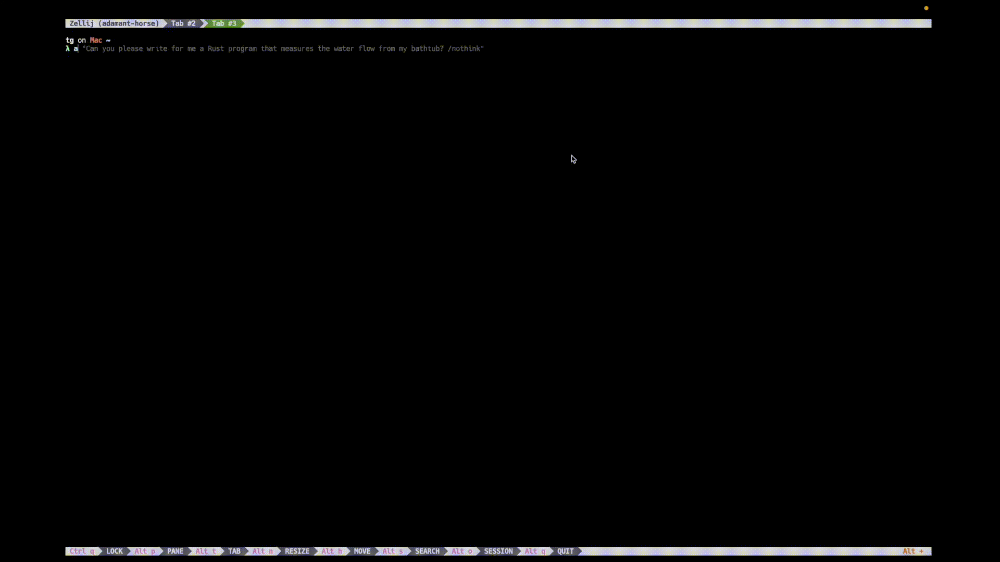

# Moldable Outputs 🧪🧱

Make aj’s output feel at home in your terminal: render Markdown with code blocks and syntax highlighting, keep a recent transcript, and customize behavior per shell.



> 🙀 This page includes ready-to-use helpers for Nushell, bash, and zsh.

## 🐚 Nushell (author’s version)

Drop this in `($nu.data-dir)/scripts/aj.nu` and source it (or add use in your config).
```shell
export def a [text: string] {
  $env.RUST_LOG = ""
  rm -f ~/.cache/aj.history
  let question = $text
  aj ask -t default -s default $text | tee { save ~/.cache/aj.history }
  clear
  print $"($question)\n\n"
  mdcat ~/.cache/aj.history
}

export def ai [session: string] {
  aj i -t refactor_rust -s $session
}
```

Usage:
```shell
a "explain lifetimes with a tiny code example"
ai refactor-session-1
```

> 💡 Tip: mdcat renders Markdown beautifully with fenced code blocks. If you don’t have it, install via your package manager (e.g., Homebrew: `brew install mdcat`). Alternatives: `glow`, `bat -l markdown`.

## 🧼 bash

Add this to `~/.bashrc` (then `source ~/.bashrc`). It mirrors the Nushell flow:
- clears any old transcript
- asks with a chosen template/session
- saves raw output to `~/.cache/aj.history`
- clears the screen
- prints the prompt you asked
- pretty-renders the Markdown transcript

```shell
# aj: ask and pretty-print Markdown response
ajmd() {
  export RUST_LOG=""
  mkdir -p "$HOME/.cache"
  rm -f "$HOME/.cache/aj.history"

  local question
  question="$*"
  if [ -z "$question" ]; then
    echo "usage: ajmd <question...>" >&2
    return 2
  fi

  # Run once, save transcript
  aj ask -t default -s default "$question" | tee "$HOME/.cache/aj.history" >/dev/null

  # Present nicely
  clear
  printf "%s\n\n" "$question"

  if command -v mdcat >/dev/null 2>&1; then
    mdcat "$HOME/.cache/aj.history"
  elif command -v glow >/dev/null 2>&1; then
    glow -p "$HOME/.cache/aj.history"
  elif command -v bat >/dev/null 2>&1; then
    bat --paging=never -l markdown "$HOME/.cache/aj.history"
  else
    # Fallback without highlighting
    cat "$HOME/.cache/aj.history"
  fi
}

# aj interactive with a handy default refactor template
ajrepl() {
  local session="$1"
  if [ -z "$session" ]; then
    echo "usage: ajrepl <session-name>" >&2
    return 2
  fi
  aj i -t refactor_rust -s "$session"
}
```
Examples:
```shell
ajmd "write a tiny Rust iterator adapter and test"
ajrepl refactor-session-2
```

## 🌀 zsh

Add this to `~/.zshrc` (then `source ~/.zshrc`). Same behavior as bash.
```shell
# aj: ask and pretty-print Markdown response
function ajmd() {
  export RUST_LOG=""
  mkdir -p "$HOME/.cache"
  rm -f "$HOME/.cache/aj.history"

  local question
  question="$*"
  if [[ -z "$question" ]]; then
    print -u2 "usage: ajmd <question...>"
    return 2
  fi

  aj ask -t default -s default "$question" | tee "$HOME/.cache/aj.history" >/dev/null

  clear
  printf "%s\n\n" "$question"

  if (( $+commands[mdcat] )); then
    mdcat "$HOME/.cache/aj.history"
  elif (( $+commands[glow] )); then
    glow -p "$HOME/.cache/aj.history"
  elif (( $+commands[bat] )); then
    bat --paging=never -l markdown "$HOME/.cache/aj.history"
  else
    cat "$HOME/.cache/aj.history"
  fi
}

# aj interactive with a handy default refactor template
function ajrepl() {
  local session="$1"
  if [[ -z "$session" ]]; then
    print -u2 "usage: ajrepl <session-name>"
    return 2
  fi
  aj i -t refactor_rust -s "$session"
}
```
Examples:
```shell
ajmd "explain pinning in Rust with a minimal example"
ajrepl rust-notes-1
```

## 💡 Notes & Tips
- Template & Session: Change `-t default -s default` to any template/session you prefer (e.g., `-t reading_buddy, -s gita-study`).
- History location: Adjust `~/.cache/aj.history` if you want per-session files (e.g., `~/.cache/aj.$(date +%s).md)` or per-template logs.
- Renderers:
    - [mdcat](https://github.com/swsnr/mdcat) → rich Markdown (links, tables, code fences)
    - [glow -p](https://github.com/charmbracelet/glow)→ pager mode
    - [bat -l markdown](https://github.com/sharkdp/bat) → quick highlighting (no Markdown rendering)
    - Paging: To page long outputs, pipe to `less -R`:
        - `mdcat ~/.cache/aj.history | less -R`
- Noise-free: `RUST_LOG=""` silences Rust log output so your Markdown stays clean.

> 🎛️✨ Have fun molding outputs to your terminal flow!